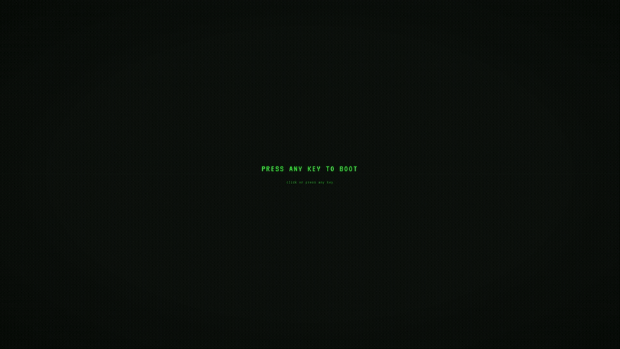

<div align="center">

# NABIL/86

**A retro UNIX desktop portfolio for Ann Naser Nabil — NLP Researcher & AI Engineer**

It cold-boots like a 1986 workstation, then drops you into a fully interactive desktop.

[](docs/media/ann-naser-nabil-1080p60.mp4)

**[Watch the full recording — 41s, 1080p60, with sound](docs/media/ann-naser-nabil-1080p60.mp4)**

</div>

---

## What it is

A portfolio that behaves like an operating system. Instead of scrolling a page, you
boot a machine: a phosphor POST screen, a scrambled name that decodes into
`Ann Naser Nabil`, a boot log of research areas and corpus stats, then a desktop
with icons, draggable windows, and a working terminal.

Everything is real UI — the windows move, the terminal executes commands, the themes
persist, and the CRT effects are live.

## Features

- **Cinematic boot sequence** — power-on flash, progress bar, scramble-decode name
  reveal with RGB split and scanline sweep, boot log, and a self-healing glitch roll.
- **Desktop environment** — icon grid, menu bar with working menus, draggable and
  focusable windows, status bar, and keyboard navigation.
- **Terminal** — a real command interpreter with `help`, `about`, `theme`, `gui`,
  `curl`, reverse search (`Ctrl+R`), and tab-completion.
- **Built-in apps** — web browser, file manager, directory and file viewers, a
  dashboard, a memo journal, and a Snake game behind the Konami code.
- **CRT rendering** — scanlines, vignette, phosphor flicker, RGB split, screen tear,
  and digital noise, plus an optional WebGL CRT warp pass.
- **Themes** — green, amber, white, blue, Dracula, Nord, Ubuntu, and Solarized.
- **Sound effects** — synthesised boot chirps, key clicks, disk seeks, and chimes
  via the Web Audio API, with a global on/off toggle.
- **Deep links** — `?skip-boot=1` / `?guest=1` to jump straight to the desktop, and
  `?open=projects` to open a specific window.
- **Responsive** — a dedicated mobile desktop layout, with motion and audio
  respecting `prefers-reduced-motion`.

## Tech stack

| Layer | Choice |
|---|---|
| UI | React 18 + TypeScript |
| Build | Vite 5 |
| State | Zustand |
| Styling | CSS Modules + CSS custom properties |
| Sound | Web Audio API (synthesised, no assets) |
| Tests | Vitest + Testing Library, Playwright (e2e) |
| Hosting | GitHub Pages |

## Getting started

```bash
npm install
npm run dev        # start the dev server
```

Other scripts:

```bash
npm run build      # typecheck + production build
npm run preview    # serve the production build
npm test           # unit tests
npm run test:e2e   # end-to-end tests
npm run size       # bundle size check
```

## Deployment

Pushing to `main` triggers `.github/workflows/deploy.yml`, which builds the site and
publishes it to GitHub Pages.

## Links

- Live: [ann.iam.bd](https://ann.iam.bd/)
- Blog: [nabil.iam.bd](https://nabil.iam.bd/)
- GitHub: [@nabil0x](https://github.com/nabil0x) · [@AnnNaserNabil](https://github.com/AnnNaserNabil)
- LinkedIn: [ann-naser-nabil](https://www.linkedin.com/in/ann-naser-nabil)
- ORCID: [0009-0006-3561-045X](https://orcid.org/0009-0006-3561-045X)
